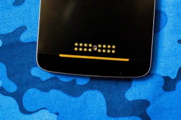
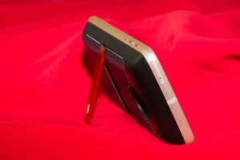

# ConCov - Smartphone cover with extensions

**Is your phone cover dumb as hell? Can it scream? Well, we will sure make it scream with AI! (not really).**

Introducing, ConCov phone cases with extensions, an open source extensible phone cover that allows you to attach and communicate to hardware extensions via the NFC/RF protocol. We also plan to support existing smartpin connectivity and build an open protocol for it.

But the smart part is not the only thing, we want to make beautiful covers with added features. An unassuming cover that will look great, and give your device durability, safety and beauty with tons of skins while also providing smart extension capabilities. 

## Practical examples

|  |
| :-----------------------------------------: |
|       *A phone with lens extension*       |

Imagine this, a lens extension, but this implementation is not connected. The smartphone does not know that the lens is attached, and can't launch the camera in the right settings when it is attached. Another example is tablets using smartpin for attaching keyboard for power and data, but having a physical connector is quite limiting. A physical connection is indeed a reliable method, but we want to try near field radio for it. We may or may end up using both, as we also plan for legacy extension compatibility like Motorolas smartpin.

|  |
| :------------------------------------------: |
|     *Motorola Z series mod smartpins*     |

|  |
| :------------------------------------------: |
|        *Mobile projector extension*        |

|  |
| :------------------------------------------: |
|          *HiFi speaker extension*          |

## Real world work

Currently this idea is in evaluation mode. We will continue working to solve the following challenges:

- Chip and connectivity: Easy part
- Manufacturing cover itself: Medium difficulty, mid size funds needed
- Manufacturing extensions/mods: Hard, large funds needed

## You are welcome to discuss or add ideas

Please fork this repo and add your comments, or use GH discussions (will soon be opened). Use bullets for replying to a document comment.

**Mon, DEC 25, 2023 Mahbub Hasan added**:
"You guys have a good method for inline discussions apart from live chats and websites? Please share"
- **Mon, DEC 25, 2023 Mahbub Hasan added**:
"This is a reply"